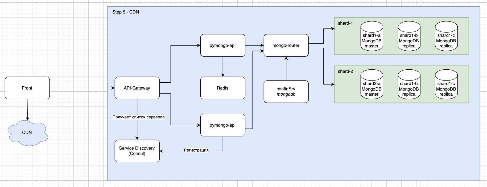

# Пример реализации шардирования и репликаци MongoDB, кеширования, использования API-Gateway и CDN.

Этот репозиторий содержит примеры реализации шардирования MongoDB. Предоставлены три отдельных проекта, демонстрирующие различные конфигурации и репликацию.

## Структура проекта

*   `mongo-sharding`: Этот проект демонстрирует базовую настройку шардирования MongoDB без репликации.
*   `mongo-sharding-repl`: Этот проект расширяет пример шардирования, включая репликацию для обеспечения высокой доступности и избыточности данных.
*   `sharding-repl-cache`: Проект, включающий реализацию шардирования с репликацией и использованием кэша для повышения производительности.

## Общая схема реализации

Общая схема реализации шагов, а также APIGateway и CDN представлена в файле `schema.drawio`.

Итоговая схема выглядит так:



## Начало работы

### Необходимые условия

*   Установленный Docker и Docker Compose.
*   Базовое понимание концепций MongoDB и шардирования.
*   Знание принципов работы APIGateway и CDN.

### Инструкции

#### 1. Клонируйте репозиторий

```bash
git clone <адрес_репозитория>
cd <каталог_репозитория>